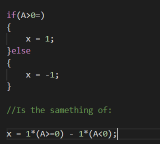
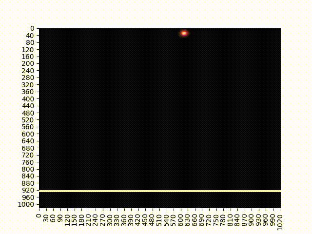
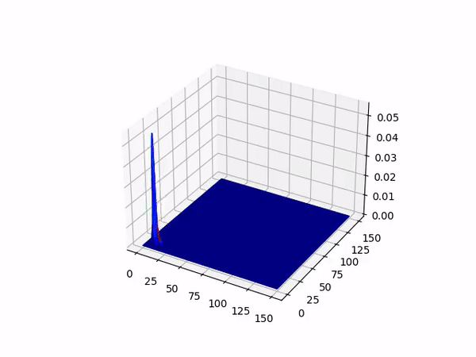

# Split_Operator_Method

# Summary

This code solves the time dependency of a Gaussian package by using "Schrödinger  Equation". For numerical results, I've used the Split-Operator Method in 2 dimensions.

The README summary will be shown as seen below:

# Packages-C++
Well, for this code we've used a lot of packages:

# Packages-Python3
Well, we plot all data in Python3 by the use of the following packages:

# Basic Constants and Considerations 
The code has three important pre-processing constants: 
BASE is used for the space discretization. Therefore, the number of points must be the power of two(), once we want to use the "divide and conquest" algorithm; hbar is the usual hbar  in quantum mechanics; mass is the mass of the gaussian package.

All functions are using a reference passing in order to improve code performance. Also, with the "as fast as possible" philosophy, I have to avoid the use of "if's", like:

# Algorithm

Let's think in a PDE like:

We can write this Hamiltonian in two parts, a real-space part and a reciprocal part ('r" and 'k" respectively) like "" where "" and '". So, taking a initial condition for "" (In my code a gaussian package):

Taking "" and using the Baker-Campbell-Housdorff formula:

The above formula has an error of "". Aiming at making it smaller, we can split the space step into two half-steps, which lead us to a "" situation:

In this "" ,where 'H' is a matrix, we are not expanding by using Taylor's series, but we are applying the exponential to each element of the matrix.

We can easily solve the above equation with Fourier and Inverse Fourier trasform (below  and  ):

# How to Use?
Well, first we must run the command "./pre\_requisites" to install all pre-requisites and create all necessary folders.

To run the '.cpp' file, you can execute "make && ./BINARY" (to compile and execute)  or just run the fallowing comand 'g++ schr\_main.cpp -larmadillo -fopenmp -lm -lfftw3 -llapacke -Ofast -lblas -o BINARY && ./BINARY' (again to compile and execute).

For the python3 program, you just need to write and run 'python3 plotar.py'.

# Results:

Some results for you have an idea about how plots are make:

A wall potential:

Almost infinite one:

