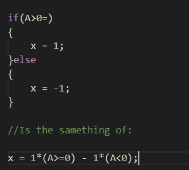

# Split_Operator_Method

# Summary

This code solves the time dependency of a Gaussian package by using "Schrödinger  Equation". For numerical results, I've used the Split-Operator Method in 2 dimensions.

The README summary will be shown as seen below:

\begin{itemize}
    \item Packages (Python3 and C++)
    \item Basic Constants and Important Considerations;
    \item Analysis of Algorithm and Method;
    \item How to use all possible files (.sh, .cpp and .py)
\end{itemize}

# Packages-C++
Well, for this code we've used a lot of packages:
\begin{itemize}
    \item Armadillo: it is the main library in my code. It is the front-end package for the whole algebra of the system (front-end for lapacke,cblas, fftw3, and openMP);
    \item OpenMP: it is the parallel library for all "for's" statements in the code, it improves the time execution a lot;
    \item Chrono: it is used for the time measurement of execution;
    \item FFTW3: it is the Fast Fourier Transform library. It's not used explicitly, but armadillo uses it in the back-end;
    \item Lapacke and Cblas: algebra libraries for armadillo back-end;
\end{itemize}

# Packages-Python3
Well, we plot all data in Python3 by the use of the following packages:

\begin{itemize}
    \item Seaborn: it is used for the heatmap plot;
    \item Matplotlib: it is used as a back-end library for Seaborn. Also, it's necessary to save images;
    \item Numpy:  it is used to load all the data in Python3;
    \item Joblib: it is used to run the image generation in parallel (important because it is the biggest time-consuming part of the code);
    \item FFMPEG: it is not a Python3 library, but, inside the Python3 code, we call a command to generate the video from plots;
\end{itemize}

# Basic Constants and Considerations 
The code has three important pre-processing constants: 
BASE é necessário para a discretização o espaço. Portanto, como queremos usar o "divide and conquest",  o numero de pontos precisa ser uma potência de 2;

BASE is used for the space discretization. Therefore, the number of points must be the power of two, once we want to use the "divide and conquest" algorithm; hbar is the usual hbar ($\frac{h}{2\pi}$) in quantum mechanics; mass is the mass of the gaussian package.

All functions are using a reference passing in order to improve code performance. Also, with the "as fast as possible" philosophy, I have to avoid the use of "if's", like:

# Algorithm

Let's think in a PDE like:

\begin{equation*}
    i\hbar \frac{\partial \psi(\textbf{r},t)}{dt} = \left(-\frac{\hbar^2}{2m} \nabla^2 + V(\textbf{r}) \right)\psi(\textbf{r},t)
\end{equation*}

We can write this Hamiltonian in two parts, a real-space part and a reciprocal part ('r" and 'k" respectively) like "$H = H_k + H_r$" where "$H_k = -\frac{\hbar^2}{2m} \nabla^2$" and '$H_r = V(\textbf{r}) $". So, taking a initial condition for "$t=0$" (In my code a gaussian package):

\begin{equation*}
    \psi(\textbf{r},t+dt) = e^{-\frac{iHdt}{\hbar}}\psi(\textbf{r},t) = e^{-\frac{i(H_k+H_r)dt}{\hbar}}\psi(\textbf{r},t) 
\end{equation*}

Taking "$dt \approx 0$" and using the Baker-Campbell-Housdorff formula:
\begin{equation*}
    \psi(\textbf{r},t+dt) = \left( e^{\frac{-iH_rdt}{\hbar}}e^{\frac{-iH_kdt}{\hbar}}e^{\frac{-[iH_r,H_K]dt^2}{2}} \right) \psi(\textbf{r},t)
\end{equation*}

The above formula has an error of "$\mathcal{O}(dt^2)$". Aiming at making it smaller, we can split the space step into two half-steps, which lead us to a "$\mathcal{O}(dt^3)$" situation:

\begin{equation*}
    \psi(\textbf{r},t+dt) = \left( e^{\frac{-iH_rdt}{\hbar}}e^{\frac{-iH_kdt}{2\hbar}}e^{\frac{-iH_rdt}{2 \hbar}} \right) \psi(\textbf{r},t) +\mathcal{O}(dt^3)
\end{equation*}

In this "$e^{H}$" ,where 'H' is a matrix, we are not expanding by using Taylor's series, but we are applying the exponential to each element of the matrix.

We can easily solve the above equation with Fourier and Inverse Fourier trasform (below $U_r = e^{-\frac{iH_rdt}{\hbar}}$ and $U_k = e^{-\frac{iH_kdt}{\hbar}}$ ):
\begin{equation*}
    \psi(\textbf{r},t) = 
    \left\{
    U_r\left(\frac{dt}{2}\right) \mathcal{F}^-1
    \left[
    U_k(dt) \mathcal{F} 
    \left( U_r\left(\frac{dt}{2} \right)\psi(\textbf{r},t)
    \right)
    \right]
    \right\}
\end{equation*}

# How to Use?
Well, first we must run the command "./pre\_requisites" to install all pre-requisites and create all necessary folders.

To run the '.cpp' file, you can execute "make && ./BINARY" (to compile and execute)  or just run the fallowing comand 'g++ schr\_main.cpp -larmadillo -fopenmp -lm -lfftw3 -llapacke -Ofast -lblas -o BINARY && ./BINARY' (again to compile and execute).

For the python3 program, you just need to write and run 'python3 plotar.py'.
